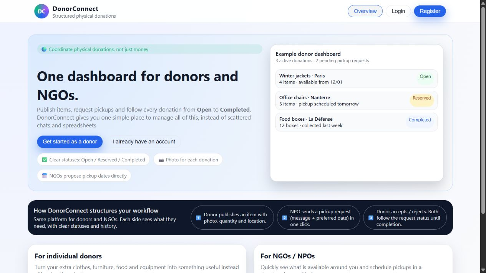
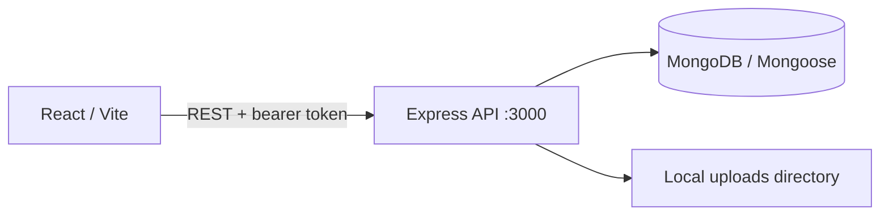

# DonorConnect

A student full-stack application for connecting donors and nonprofit
organizations. Donors publish items; organizations browse donations and submit
requests. The repository contains an Express/MongoDB API and a React interface.

**Status:** student development project with automated API checks, passing lint
and a frontend production build. Selected authentication and ownership paths
are regression-tested; further deployment hardening is still needed.



Local browser capture; the preview cards contain illustrative data. Landing,
login and both donor/NPO registration forms were checked in the browser.

## Architecture



- Backend: Node.js, Express, Mongoose, JWT, bcrypt and Multer.
- Frontend: React, React Router, Axios and Vite.
- API areas: authentication, users, donations and donation requests.
- Donation list supports pagination, category/status filtering and text search.
- Donor forms support image upload; requests expose accept/reject/cancel actions.

These describe implemented routes and UI flows, not an end-to-end acceptance
test or a claim that every authorization path is secure.

## Repository layout

```text
donorconnect-backend/
  src/                  API, models, middleware and validation
  test/                 API/security, isolated database and utility tests
donorconnect-frontend/
  src/                  React pages, contexts, API client and route guard
.github/workflows/      Monorepo backend/frontend checks
```

Run commands in the relevant component directory. The root is not an npm
workspace. See the [backend guide](donorconnect-backend/README.md) and
[frontend guide](donorconnect-frontend/README.md).

## Local development

Use Node.js 22.12 or later in the 22.x line (reviewed with 22.13), npm and a
separately provisioned development MongoDB database. The backend declares its
dependency requirement of Node.js 20.19 or later; Node.js 22.12+ also satisfies
the frontend's requirements.

1. Install dependencies separately with `npm ci` in each component.
2. Supply `MONGO_URI` and a strong `JWT_SECRET` to the backend process using
   local environment variables or an existing ignored environment file.
3. Start the backend on port 3000 and the Vite frontend in a second terminal.
4. Use synthetic data and an isolated database while the development/security
   work is unfinished.

Never commit credentials or copy a real connection string into an issue or
README. Existing environment files are local configuration and are not part of
this guide.

## Verification status — 29 September 2026

| Check | Result |
| --- | --- |
| Backend dependency install | Passed with lifecycle scripts disabled |
| Frontend dependency install | Passed with lifecycle scripts disabled |
| Frontend `npm run build` | Passed |
| Backend `npm test` locally | 30 passed; 2 database integration cases skipped without a disposable MongoDB service |
| Backend `npm run lint` | Passed |
| Frontend `npm run lint` | Passed |
| Database-backed API flows | CI runs the two integration cases using an isolated MongoDB service |
| Containers / Kubernetes | No such deployment configuration on this branch |

The current health endpoint is `GET /api/health`. Obsolete tests for removed lab
routes were replaced with checks for the current API, registration roles,
configuration, admin password hashing and donation deletion ownership. Existing
utility tests remain.

[Monorepo CI](.github/workflows/ci.yml) runs backend lint/tests against a
disposable MongoDB service and frontend lint/build in separate jobs. Each job
uses the correct component directory and lockfile. Integration tests only use
`TEST_MONGO_URI`, require a loopback service and create a randomly named test
database; they never use the application's `MONGO_URI`.

## Security decisions and remaining limits

- JWT configuration is shared by signing and verification; startup rejects a
  missing secret or the former development fallback.
- Public registration only permits donor/npo roles and stores the validated
  profile fields. Administrative creation hashes passwords too.
- Donation deletion includes the authenticated owner in the database filter.
- User updates allowlist fields; first-admin bootstrap is disabled by default.
- Diagnostics, donation update field restrictions, request state transitions,
  rate limiting, upload content checks,
  CORS policy and browser token storage still need a deployment-focused review.

These controls and tests cover specific paths, not a comprehensive security
assessment or a production-readiness claim.

## Deployment scope

The frontend API address is currently hardcoded to
`http://localhost:3000/api` in `src/api.js`. Uploads use backend-local storage.
No Dockerfile, Compose stack, Kubernetes manifests, GitOps controller or
monitoring stack is supplied in the current main layout.
