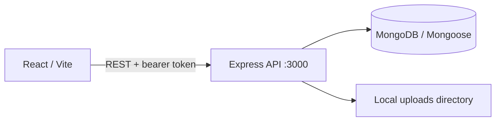

# DonorConnect

A student full-stack application for connecting donors and nonprofit
organizations. Donors publish items; organizations browse donations and submit
requests. The repository contains an Express/MongoDB API and a React interface.

**Status:** development project. The frontend builds, but the backend test suite
and both lint checks need repair. Authentication and authorization need further
hardening before shared or public deployment.

## Architecture



- Backend: Node.js, Express, Mongoose, JWT, bcrypt and Multer.
- Frontend: React, React Router, Axios and Vite.
- API areas: authentication, users, donations and donation requests.
- Donation list supports pagination, category/status filtering and text search.
- Donor forms support image upload; requests expose accept/reject/cancel actions.

These describe implemented routes and UI flows, not an end-to-end acceptance
test or a claim that every authorization path is secure.

## Repository layout

```text
donorconnect-backend/
  src/                  API, models, middleware and validation
  test/                 Legacy HTTP tests and utility tests
  .github/workflows/    Legacy nested workflow
donorconnect-frontend/
  src/                  React pages, contexts, API client and route guard
```

Run commands in the relevant component directory. The root is not an npm
workspace. See the [backend guide](donorconnect-backend/README.md) and
[frontend guide](donorconnect-frontend/README.md).

## Local development

Use Node.js 22.12 or later in the 22.x line (reviewed with 22.13), npm and a
separately provisioned development MongoDB database. The older backend
`engines` declaration is looser than its current dependencies allow.

1. Install dependencies separately with `npm ci` in each component.
2. Supply `MONGO_URI` and a strong `JWT_SECRET` to the backend process using
   local environment variables or an existing ignored environment file.
3. Start the backend on port 3000 and the Vite frontend in a second terminal.
4. Use synthetic data and an isolated database while the development/security
   work is unfinished.

Never commit credentials or copy a real connection string into an issue or
README. Existing environment files are local configuration and are not part of
this guide.

## Verification status — 29 September 2026

| Check | Result |
| --- | --- |
| Backend dependency install | Passed with lifecycle scripts disabled |
| Frontend dependency install | Passed with lifecycle scripts disabled |
| Frontend `npm run build` | Passed |
| Backend `npm test` | 9 passed, 6 failed |
| Backend `npm run lint` | Fails: no ESLint configuration |
| Frontend `npm run lint` | 10 errors, 3 warnings |
| Database-backed app startup / user flows | Not exercised in this review |
| Containers / Kubernetes | No such deployment configuration on this branch |

The six failing tests target legacy `/health`, `/info`, `/version` and `/boom`
routes. The current health endpoint is `GET /api/health`. Resolve the intended
API contract before changing those tests; a green frontend build does not prove
that API workflows work.

The workflow under `donorconnect-backend/.github/workflows/` is not at the
repository-root location used by GitHub Actions. It also assumes the old
single-component layout. Active CI, lint repair and meaningful API tests remain
follow-up work.

## Deployment scope

The frontend API address is currently hardcoded to
`http://localhost:3000/api` in `src/api.js`. Uploads use backend-local storage.
No Dockerfile, Compose stack, Kubernetes manifests, GitOps controller or
monitoring stack is supplied in the current main layout.
